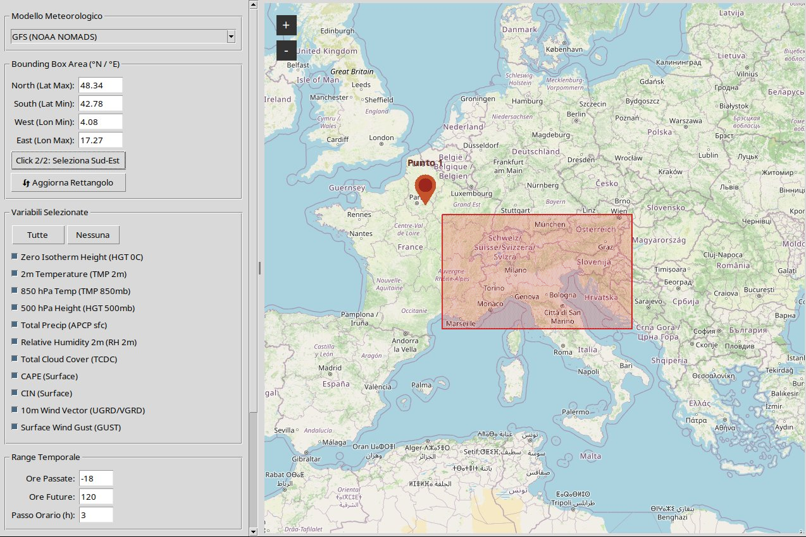

# GFS & ICON-EU GRIB2 Subregion Downloader
## (Interactive Map Edition) 🌍🌦️

eather GRIB2 Downloader is a Python-based GUI application designed to simplify the extraction of subsetted **GFS** (0.25°) and **ICON-EU** meteorological data in **GRIB2** format directly from NOAA NOMADS and DWD OpenData servers.

    Interactive Selection: Select your geographic area of interest (Bounding Box) via 2 clicks on an integrated interactive map.

    Compatibility: Downloaded GRIB2 files are fully compatible with **XyGrib** for visualization and **GrADS** for advanced processing.




[](https://www.python.org/)
[](https://www.gnu.org/licenses/gpl-3.0)
[](https://www.wmo.int/)
[](http://cola.gmu.edu/grads/)

---

## 🌟 Features

* **Interactive Map Selector:** Define bounding box boundaries (N/S/W/E) visually using an integrated OpenStreetMap interface.
* **Strict Variable & Level Mapping:** Direct coupling of variables to specific vertical levels to eliminate server HTTP 404 errors.
* **Multi-Variable Support:** Includes 0°C Isotherm, Temperature (2m, 850hPa), Geopotential Height (500hPa), Wind Vectors (10m, Gusts), CAPE, CIN, Total Precipitation, and Cloud Cover.
* **Seamless Time Windowing:** Combines past analysis runs and future forecast steps into a single unified output file.
* **Native GrADS Compatibility:** Generates a unified `.grb2` output completely structure-mapped for `g2ctl` and `gribmap`.
* **Threaded Execution:** Multi-threaded architecture ensures a responsive user interface during heavy downloads.

## 🚀 What's New in Version 2.0.0

* **Integrated Interactive Map**: Define the geographic Bounding Box directly via 2 clicks on the map.
* **Multi-Model Support**:
  * **GFS (NOAA)**: Custom downloads filtered by bounding box, time range, and specific variable selection (temperature, wind vectors, precipitation, CAPE, CIN, geopotential height, etc.).
  * **ICON-EU (DWD)**: Automated retrieval and `bz2` decompression of single-level parameters directly from DWD OpenData.
* **Console Debug Logging**: Real-time tracking of file names and download links printed directly to the terminal console.

---


## 🛠️ System Requirements & Dependencies

### System Dependencies (Linux)
Ensure Python 3 and Tkinter graphics support are installed on your Linux distribution:

```bash
# Ubuntu / Debian
sudo apt update
sudo apt install python3 python3-pip python3-venv python3-tk

# Fedora / RHEL
sudo dnf install python3 python3-pip python3-tkinter

```
### 🚀 Quick Start (Local Setup)

    Clone the Repository

```bash
git clone [https://github.com/YOUR-USERNAME/gfs-downloader.git](https://github.com/YOUR-USERNAME/gfs-downloader.git)
cd gfs-downloader
Set Up Python Virtual Environment (venv)
python3 -m venv venv
source venv/bin/activate
Install Dependencies
pip install --upgrade pip
pip install -r requirements.txt
Run the Application
python src/gfs_downloader_gui.py

```
## 📊 GrADS Data Processing Workflow

Once your .grb2 file (e.g., gfs_custom_alps.grb2) is downloaded, follow these standard steps to analyze the dataset in GrADS:
# 1. Generate the Control Descriptor file (.ctl)
```bash
g2ctl gfs.grb2 > gfs.ctl
```
# 2. Build the GRIB map index file (.idx)
```bash
!gribmap -v -i gfs.ctl 0
```

# 3. Launch GrADS
```bash
grads
ga-> open gfs.ctl
ga-> set lon 5 16
ga-> set lat 43.5 48
ga-> d tmp2m-273.15
```

## Repository Structure
gfs-downloader/
├── .gitignore                  # Regole per escludere file temporanei
├── LICENSE                     # Licenza open-source (MIT)
├── README.md                   # Documentazione del progetto
├── requirements.txt            # Dipendenze Python (tkintermapview, Pillow)
└── gfs_downloader_gui.py       # Script principale 