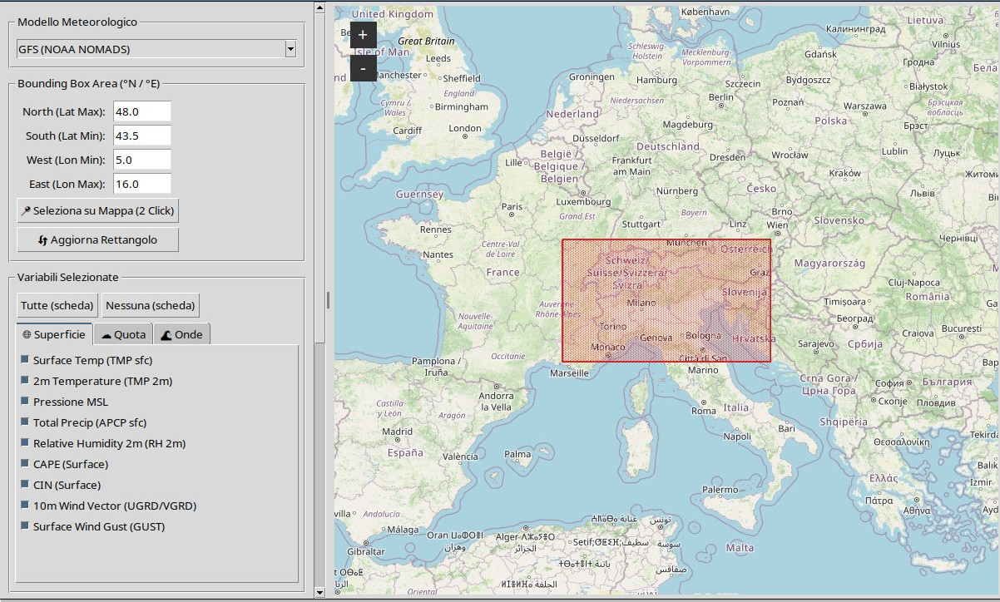
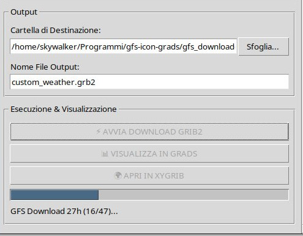
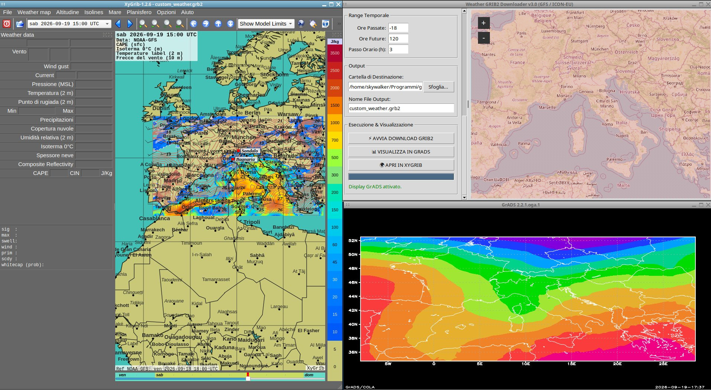

```markdown
# Weather GRIB2 Downloader v3.2.0
## Automated Subregion Extraction with GFS Wave & Direct XyGrib / GrADS Integration 🌍📊

[](https://www.python.org/)
[](https://www.gnu.org/licenses/gpl-3.0)
[](https://www.wmo.int/)
[](http://cola.gmu.edu/grads/)
[](https://opengribs.org/)

Weather GRIB2 Downloader v3.2.0 is a powerful Python GUI application designed to extract subsetted **GFS** (0.25°), **GFS Wave**, and **ICON-EU** weather data in **GRIB2** format. It features an intuitive tabbed interface, persistent configuration management, and seamless one-click integration with **XyGrib** and **GrADS** for real-time visualization and spatial analysis.

---

## 🌟 Key Features

* **Interactive Map Selector:** Define your geographic bounding box (N/S/W/E) visually using a 2-click interface powered by OpenStreetMap.
* **GFS Wave Integration:** Full support for oceanographic parameters (Significant Wave Height, Wave Direction, Peak/Mean Periods, Primary/Secondary Swell components) directly alongside atmospheric data.
* **Tabbed Variable Navigation:** Organized into 3 clean categories: **Surface**, **Upper Air**, and **Waves** with tab-specific selection controls (`All (Tab)` / `None (Tab)`).
* **Strict Variable & Level Mapping:** Direct coupling of meteorological variables to specific vertical levels to prevent HTTP 404 server errors on NOAA NOMADS.
* **Multi-Model Support:**
  * **GFS & GFS Wave (NOAA)**: Custom subsetting by bounding box, time step ranges, and target variables.
  * **ICON-EU (DWD)**: Automated download and `.bz2` decompression of single-level parameters directly from DWD OpenData.
* **Flexible Time Horizon:** Seamlessly merges past analysis runs and future forecast steps into a single unified GRIB2 file.
* **Automated GrADS Integration:** Dynamic generation of `startup.gs` control scripts with automatic `g2ctl` and `gribmap` indexing.
* **Cross-Platform XyGrib Integration:** One-click launch across Linux, macOS, and Windows.
* **Persistent Settings Management:** Automatically saves and restores user preferences, bounding boxes, and variable selections across restarts via JSON.
* **Multi-threaded Architecture:** Keeps the graphical interface smooth and responsive during active downloads.

---

## 📸 Application Screenshots

<p align="center">
  <b>1. Main Tabbed Interface & Interactive Map Selection</b><br>
  
</p>

<br>

<p align="center">
  <b>2. Real-Time Multi-threaded Download Progress</b><br>
  
</p>

<br>

<p align="center">
  <b>3. Direct One-Click Visualization in XyGrib and GrADS</b><br>
  
</p>

---

## 🚀 What's New in Version 3.2.0

* **GFS Wave Model Integration:** Full native support for GFS Wave dataset downloads, allowing seamless inclusion of marine and oceanographic parameters (SHTS, DIRPW, PERPW, etc.).
* **Redesigned Tabbed Variable Interface:** Replaced long single-column checkboxes with a clean 3-tab Notebook view (**Surface**, **Upper Air**, **Waves**).
* **Tab-Scoped Selection Controls:** Introduced **`All (Tab)`** and **`None (Tab)`** action buttons that toggle variables *only* in the currently active tab.
* **Optimized Workflow Layout:** Moved the **"💾 Save Configuration"** button directly below the variable tab selection area for an intuitive top-to-bottom setup flow.
* **Enhanced Persistence:** Updated `ConfigManager` to save and restore active selections independently across all 3 tabs for both GFS and ICON-EU models.

---

## 🛠️ System Requirements & Dependencies

### Linux (Ubuntu / Debian / Fedora)
Ensure Python 3, Tkinter, and external visualizers are installed on your system:

```bash
# Ubuntu / Debian
sudo apt update
sudo apt install python3 python3-pip python3-venv python3-tk grads g2ctl xygrib

# Fedora / RHEL
sudo dnf install python3 python3-pip python3-tkinter grads xygrib

```

### macOS (via Homebrew)

Install Python 3, Tkinter support, and external visualization tools using [Homebrew](https://brew.sh/):

```bash
# Install dependencies via Homebrew
brew install python python-tk grads

# Install XyGrib (if using Cask/binary, or download directly from OpenGribs)
brew install --cask xygrib

```

> **macOS Note:** Ensure `python3-tk` (Tkinter) is properly linked to your Python installation so the GUI opens smoothly without graphics engine warnings.

---

## 🚀 Quick Start

### 1. Clone the Repository

```bash
git clone [https://github.com/enrico-gpe/grib2-downloader.git](https://github.com/enrico-gpe/grib2-downloader.git)
cd grib2-downloader

```

### 2. Set Up Python Virtual Environment (venv)

```bash
python3 -m venv venv
source venv/bin/activate
pip install --upgrade pip
pip install -r requirements.txt

```

### 3. Run the Application

```bash
python3 main.py

```

---

## 📊 Data Visualization Workflow

Once your download completes (e.g., `custom_weather.grb2`), you can explore the data directly from the application's GUI:

* 📊 **VISUALIZZA IN GRADS:** Automatically runs `g2ctl` and `gribmap`, creates `startup.gs`, and opens the session.
* 🌍 **APRI IN XYGRIB:** Launches XyGrib and opens the `.grb2` file immediately.

> **Note:** GrADS functionality is guaranteed when downloaded from OpenGrADS or compiled with native GRIB2 support; in some Linux distribution packages, `gribmap` may fail to index GRIB2 files properly.

---

## 💡 Quick Launch Alias

To launch the downloader quickly from any terminal session, add the function to your shell configuration file:

* **Linux (Bash):** `~/.bashrc`
* **macOS (Zsh):** `~/.zshrc`

```bash
function xygrib-downloader() {
    cd ~/Programmi/gfs-icon-grads/gfs_downloader || return
    source venv/bin/activate
    python3 main.py
    deactivate
}

```

After editing, apply the changes with `source ~/.bashrc` (Linux) or `source ~/.zshrc` (macOS).

---

### 📄 License

Distributed under the GNU General Public License v3.0 (GNU GPLv3). See the [LICENSE](https://www.google.com/search?q=LICENSE) file for details.

```

```